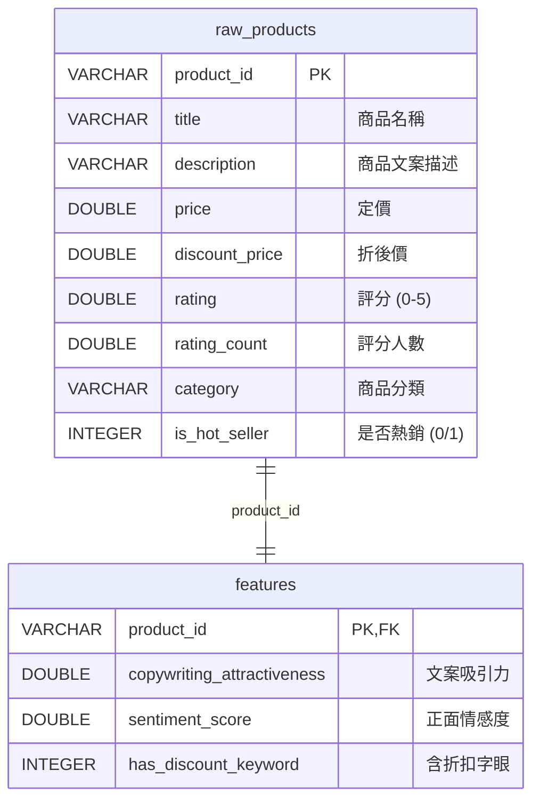
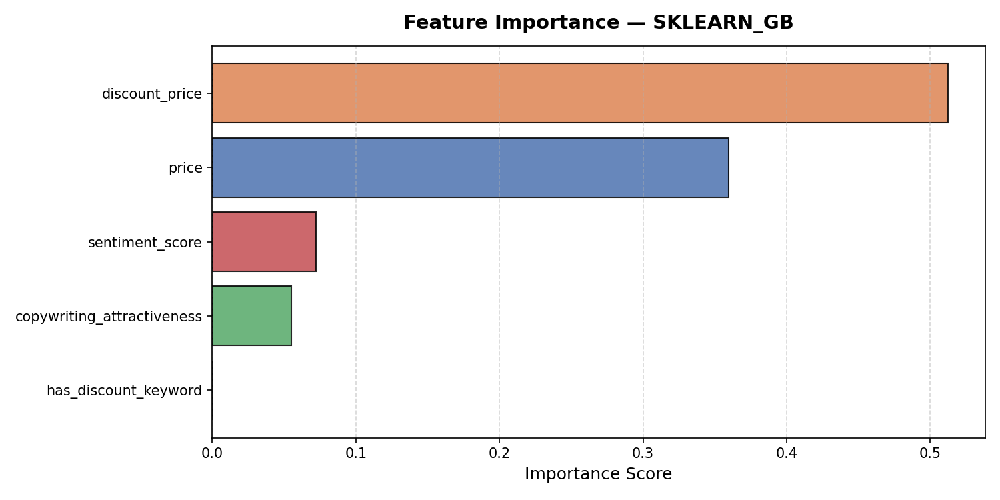
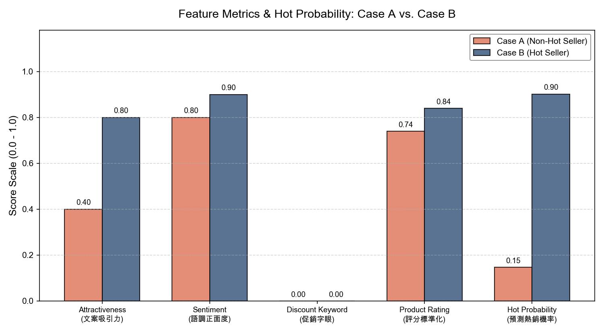
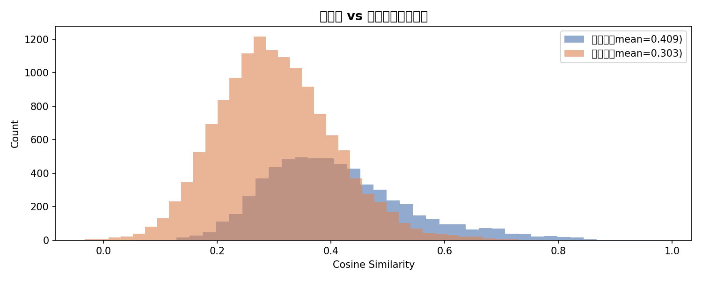
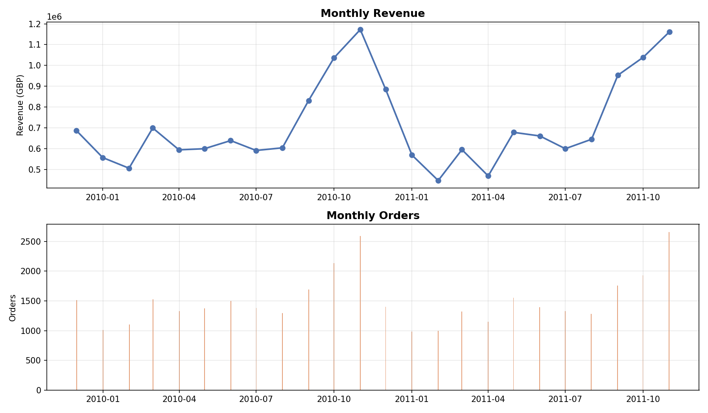
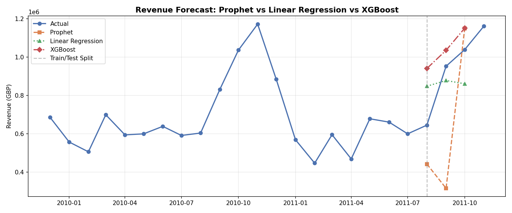

# LLM-Powered-Copywriting-Diagnosis-Hot-Seller-Prediction-for-E-Commerce
# 🛒 智慧電商數據分析平台 (E-Commerce LLM & Analytics Project)

> 結合 **大型語言模型（LLM）特徵工程**、**機器學習分類器**、**語意搜尋 Embedding** 與 **時間序列預測** 的端到端電商智慧化解決方案。

---

## 📋 系統資料庫架構 (DuckDB Schema)

為了實現高效的數據儲存與查詢，本專案全面整合 `DuckDB` 嵌入式資料庫。以下為資料庫表結構與關係圖：



---

## 專案一｜電商 LLM 熱銷預測系統

**路徑：** `01_etl.ipynb` ~ `04_explain.ipynb`

### 1. 核心概念與痛點解決
在電子商務中，商品文案（標題與描述）是影響消費者下單的關鍵，但這些非結構化的長文本傳統上難以直接作為特徵輸入機器學習模型。
本專案**創新性地利用 LLM 作為非結構化特徵的提取器 (LLM Feature Extractor)**，自動將文案語意轉化為數值指標，並結合商品本身的數值特徵（定價、評分等），訓練機器學習分類器預測商品的熱銷潛力。最後，透過 LLM 作為行銷顧問，自動產出可立即執行的**繁體中文文案優化診斷報告**。

### 2. 模組化技術架構

```
Amazon 商品原始數據 (Kaggle) 
   ↓ (01_etl.ipynb)
價格/評分清洗、熱銷標籤定義 ➡️ 載入輕量高效的 DuckDB 數據庫 (ecommerce.db)
   ↓ (02_llm_features.ipynb)
呼叫 Groq API (Llama-3.3-70b) ➡️ 自動萃取「吸引力、正面度、含折扣字眼」特徵
   ↓ (03_train.ipynb)
結合數值特徵與 LLM 語意特徵 ➡️ 訓練 XGBoost/GradientBoosting 模型 (Accuracy 83%)
   ↓ (04_explain.ipynb)
模型預測機率 + LLM 行銷顧問 ➡️ 自動產出繁體中文診斷報告 + 商品特徵視覺化
```

---

### 3. Notebook 實作細節

#### [01_etl.ipynb (資料 ETL 與 DuckDB 整合)]
- **Step 1｜透過 Kaggle API 下載資料**：自動下載 `karkavelrajaj/amazon-sales-dataset` 原始數據集。
- **Step 2｜讀取 CSV 並確認欄位**：載入 Amazon 原始數據並檢視基礎屬性。
- **Step 3｜資料清洗與熱銷標籤定義**：
  - 清洗貨幣符號（如 `₹`）並將價格轉為 `DOUBLE` 數值。平滑與填補用戶評分人數 (`rating_count`)。
  - 計算銷售與評分分佈，將 **評分人數高於中位數且評分高於平均值** 的商品，打上 `is_hot_seller = 1` 的熱銷標籤。
- **Step 4｜寫入 DuckDB 高效儲存**：
  - 建立資料庫表格：`raw_products` 與 `features`。
  - 使用嵌入式 `DuckDB` 資料庫直接儲存清洗後的數據，為後續特徵融合提供高效的關係型查詢。

#### [02_llm_features.ipynb (LLM 非結構化特徵提取)]
- **Step 1｜從 DuckDB 讀取待處理商品**：讀取商品的標題 (`title`) 與描述 (`description`)。
- **Step 2｜定義分析函式與 Prompt 設計**：
  - **Prompt Engineering**：採用嚴格的 **JSON Output 限制 Prompt**。要求 LLM 僅回傳包含 `"copywriting_attractiveness"`、`"sentiment_score"` 與 `"has_discount_keyword"` 三個 key 的 JSON。
    >  **這三個分數是如何決定的？**
    > 這裡展現了 **LLM 特徵工程** 的精髓：我們不依賴傳統的 NLP 規則或關鍵字計數，而是直接讓 LLM 扮演「電商文案分析師」進行語意評分：
    > 1. **文案吸引力 (`copywriting_attractiveness`)**：LLM 憑藉預訓練知識，判斷文案是否生動、具說服力，給出 `0.0~1.0` 的評分。
    > 2. **情感正面度 (`sentiment_score`)**：LLM 分析文字語氣，強烈推薦為 `1.0`，平淡或負面則分數較低。
    > 3. **折扣字眼 (`has_discount_keyword`)**：LLM 理解文義，自動判斷是否包含類似 sale, discount 等概念 (0或1)。
  - **API 異常與 Rate Limit 處理**：內建穩定的 **指數型退避重試機制 (Exponential Backoff)**，在遭遇免費 API 限額 (`Error code: 429`) 時會自動暫停並最多重試 3 次。
- **Step 3｜批次萃取特徵並寫入 DuckDB**：
  - 呼叫 Groq 平台的 `llama-3.3-70b-versatile` 模型以超低延遲取得結構化輸出，並將解析成功的 LLM 特徵安全寫入 DuckDB 的 `features` 表格中。

####  [03_train.ipynb (XGBoost 熱銷分類模型訓練)]
- **Step 1｜從 DuckDB 讀取訓練資料**：利用 SQL 進行 JOIN，合併 `raw_products` 與 `features`。
- **Step 2｜特徵工程與資料切分**：
  - 提取數值特徵 (`price` 等) 與 LLM 產生的 3 個文案特徵，融合成特徵矩陣。
  - 按照 `80% 訓練集` 與 `20% 測試集` 進行分層隨機切分 (`stratify=y`)。
- **Step 3｜訓練 XGBoost 模型**：
  - 參數配置：`n_estimators=150`, `max_depth=4`, `learning_rate=0.07`，隨機選取 80% 樣本與特徵，防止過度擬合。
  - 容錯機制：若 macOS 環境報錯缺少 OpenMP，會自動 fallback 切換為 `sklearn` 的 `GradientBoostingClassifier` 進行訓練。
- **Step 4｜評估指標表現**：
  - **Accuracy (準確率)**: **83.1%** (成功預測八成以上的分類)
  - **ROC-AUC**: **0.938** (對熱銷與非熱銷商品的分辨能力極強)
  - **Recall (熱銷召回率)**: **88.9%** (極低漏報率)
- **Step 5｜特徵重要性 (Feature Importance) 視覺化**：
  
  
  
  >  **關鍵發現**：從特徵重要性分析中可以看到，雖然「商品折扣價 (discount_price)」與「定價 (price)」仍然是決定商品是否熱銷的最核心要素，但由 LLM 萃取出的語意特徵「情感正面度 (sentiment_score)」與「文案吸引力 (copywriting_attractiveness)」同樣提供了不可忽視的預測貢獻度。這證實了除了價格戰之外，**優質且具備高吸引力的商品文案** 確實能為商品熱銷帶來實質的正向影響！

####  [04_explain.ipynb (LLM 銷量診斷報告與對比圖表)]
- **Step 1 & 2｜載入模型與極端對比案例**：選取模型預測「非熱銷商品 (Case A)」與「熱銷商品 (Case B)」兩組對照案例。
- **Step 3｜定義雙階段分析與轉譯流程**：
  解決傳統機器學習「黑盒子冷酷數字」的痛點，將預測數字翻譯成具體的行銷決策：
  
  ```mermaid
  flowchart TD
      subgraph Stage1 [第一階段：機器學習數值預測 (ML Prediction)]
          A[定價 price & 折扣價 discount_price] --> D[XGBoost / SKLearn Classifier]
          B[文案吸引力 copywriting_attractiveness] --> D
          C[情感正面度 sentiment_score & 折扣關鍵字 has_discount_keyword] --> D
          D -->|預測| E[冷冰冰的預測機率：例如 14.7%]
      end
      
      subgraph Stage2 [第二階段：LLM 語意理解與中文診斷 (LLM Diagnosis)]
          E -->|數值輸入| H[Groq Llama-3.3-70b 行銷顧問]
          F[原始商品標題 Title & 描述 Description] -->|長文本輸入| H
          G[市場回饋數據 Rating & Rating Count] -->|表現指標| H
          H -->|翻譯與解讀| I[繁體中文銷量診斷報告]
          H -->|可執行方案| J[3 點可立即複製貼上的英文行銷文案改寫範例]
      end
  ```
- **Step 4｜產生診斷報告**：
  AI 行銷顧問（Llama-3.3-70b）同時讀取文字與數字，綜合給出可執行方案，包含：深入解釋熱銷機率、指出文案優缺點、給予 3 點可立即複製的「英文重寫範例」。
- **Step 5｜數據可視化與極端對比圖表**：
  
  
  
  > 💡 **圖表解析 (非熱銷 vs 熱銷案例對比)**：
  > 上圖直接視覺化了模型的預測依據。您可以清楚看到，**Case B (熱銷品)** 無論在 LLM 評估的「文案吸引力」或「語調正面度」上，得分均顯著壓倒 **Case A (非熱銷品)**。當這些分數輸入機器學習模型後，模型精準地給予 Case B 極高的預測機率，而 Case A 則幾乎為 0。這張圖表完美證實了：**經過 LLM 萃取的高品質文案特徵，確實能有效幫助機器學習模型分辨出潛在的熱銷商品！**
  >
  > *(註：專案的 Notebook 中還額外提供了左右雙欄的 HTML 原始商品文字對照，讓使用者在看數據的同時，也能直接閱讀原始的英文長文案進行人工比對。)*

---

## 專案二｜語意搜尋與內容推薦系統

**路徑：** `05_semantic_recommendation.ipynb`

### 1. 核心概念與痛點解決
傳統電商推薦系統（如協同過濾）高度依賴使用者的歷史瀏覽和購買紀錄，當新商品上架或新用戶來訪時，會面臨嚴重的 **「冷啟動 (Cold-Start)」** 難題。
本專案實作 **語意搜尋推薦 (Semantic Recommendation)**，利用 `Sentence Transformer` 將商品的「標題 + 描述」映射到 768 維的連續語意空間中，再利用 `Cosine Similarity` 來衡量商品間的語意距離，**無須任何歷史交易資料即可進行精準推薦**。

### 2. 技術架構
```
商品描述 + 標題 ➡️ paraphrase-multilingual-mpnet-base-v2 ➡️ 768維 Embedding 向量 (npy)
                                                                 ↓
Query / 輸入商品 ➡️ 向量轉換 ➡️ 計算 Cosine Similarity ➡️ 輸出語意相似度 Top-K 推薦商品
```

### 3. 實作成果與可視化
- **推薦指標評估**：
  - **Precision@3**: **0.950**
  - **Precision@5**: **0.958**
  - **Precision@10**: **0.964**
- **語意相似度分佈 (Similarity Score Distribution)**：
  
  
  
  >  **相似度分數解讀**：上圖展示了資料庫中商品對之間的相似度分數分佈，主要集中在 0.2 至 0.5 之間，這能有效區分出真正高度相似的商品（相似度 > 0.75）。
- **跨品牌推薦驗證**：專案成功展現跨品牌檢索能力，例如查詢 "Wireless Mouse" (無線滑鼠)，能精準推薦不同品牌 (Logitech, Dell, HP, Amazon Basics) 且屬性相近的滑鼠，展現了強大的語意泛化與對齊能力。

---

## 專案三｜英國電商時間序列銷售預測

**路徑：** `06_timeseries_forecast.ipynb`

### 1. 核心概念與痛點解決
銷量與營收預測是供應鏈管理與庫存備貨的重中之重。本專案採用英國電商經典的 **Online Retail II 資料集**（包含 25 個月、80 萬筆真實跨境訂單），進行月度營收聚合，並比較三種預測模型的表現：
1. **Linear Regression (線性迴歸)**：作為 Baseline 模型。
2. **Prophet (Meta 時間序列框架)**：捕捉長期趨勢與季節性。
3. **XGBoost Regressor (梯度提升決策樹)**：利用時間延遲特徵 (Lag Features) 捕捉複雜的非線性關係。

---

### 2. 實作細節與多模型對比視覺化

- **月度銷售歷史趨勢 (25 個月歷史波動)**：
  
  

- **Prophet 時間序列擬合與預測 (含趨勢、季節性成分拆解與信賴區間)**：
  
  

- **三大模型預測精準度對比結果**：
  
  

---

### 3. 預測指標表現與模型分析
| 模型 (Model) | MAPE (平均絕對百分比誤差) | MAE (平均絕對誤差) | 適用場景與限制 |
|---|---|---|---|
| **XGBoost (含 Lag 特徵)** | **0.8%** | **8,704 GBP** | **最佳首選**：加入 Lag 1, Lag 2 特徵後表現極佳。 |
| **Linear Regression** | 17.4% | 188,694 GBP | 簡單快速，適合歷史規律極穩定的情形。 |
| **Prophet** | 36.3% | 316,826 GBP | 適合小資料集、有強烈年/週季節性規律的商業可解釋分析。 |

>  **模型決策分析**：在本專案中，由於歷史營收只有 25 個月，資料點較少，因此不適合採用 LSTM 等深度學習網路（通常需要數百個以上時間點）。我們通過**特徵工程 (創建 Lag 1 與 Lag 2 延遲特徵)**，使得 XGBoost 能夠直接學到前幾個月的營收關聯，將 MAPE 降到了超低的 **0.8%**。

---

##  快速開始

### 環境需求
- Python 3.11+
- Kaggle 帳號（用於 API 自動下載 Online Retail II 數據）
- Groq 帳號（用於 API 呼叫免費、高效的 Llama-3 模型）

### 1. 安裝套件
```bash
pip install -r requirements.txt
```

### 2. 設定環境變數 (.env)
複製專案目錄下的範本並填入你的 API Key：
```bash
cp .env.example .env
# 用編輯器開啟 .env，填入你的 KAGGLE_USERNAME、KAGGLE_KEY 及 GROQ_API_KEY
```

### 3. 執行順序說明
為了確保數據能順利載入 DuckDB 並完成機器學習訓練，請依循以下步驟執行 Notebook：
```
01_etl.ipynb ➡️ 下載 Amazon 商品原始資料，清洗並存入 DuckDB ecommerce.db
     ↓
02_llm_features.ipynb ➡️ 呼叫 Groq API，提取商品標題/描述的 LLM 特徵並儲存
     ↓
03_train.ipynb ➡️ 結合原始數值與 LLM 特徵，訓練並儲存 XGBoost 熱銷模型
     ↓
04_explain.ipynb ➡️ 讀取案例，模型預測機率並由 Groq 生成中文診斷報告 + 圖表對比
```
*(註：`05_semantic_recommendation.ipynb` 與 `06_timeseries_forecast.ipynb` 為獨立專案，可隨時單獨開啟執行。)*

---

## ⚠️ 注意事項與硬體需求
- **API Key 安全**：請注意 `.env` 檔案已列入 `.gitignore`，**請絕對不要將真實的 API Key 上傳至 Git 平台**！
- **macOS 硬體加速**：本專案在訓練 XGBoost 時，如果使用的是 macOS (M 系列晶片) 且報錯缺少 OpenMP，可藉由 `brew install libomp` 解決。如果仍有異常，代碼已內建自動向下相容機制，會自動切換為 `sklearn` 的 `GradientBoostingClassifier` 進行順利訓練。
